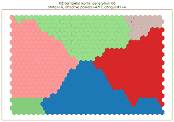
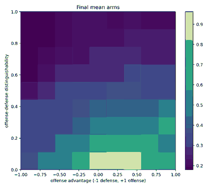

# Game of International Life

[](https://github.com/ReloadLightly/game-of-international-life/actions/workflows/ci.yml)

**Cellular automata, artificial life, and evolutionary rule discovery for international relations under anarchy.**

> How much international order—and disorder—can emerge from simple local rules of threat perception, arming, territorial competition, alliance commitment, and adaptation?

Game of International Life begins with a faithful implementation of **Conway's Game of Life** and then builds explicitly theory-bearing computational worlds for international relations. The aim is not to rename living cells “states” and call the result realism. The aim is to translate theoretical mechanisms into inspectable transition rules, derive system-level patterns from local interaction, and compare rival explanations under matched conditions.

Version **0.2** now contains three working layers:

- **M0:** canonical Conway B3/S23;
- **M1:** a Jervisian security-dilemma cellular automaton;
- **M2:** a hexagonal world of connected territorial states, local resources, aggregated capability, conquest, extinction, and fragmentation.

<p align="center">
  
</p>

The M2 image is one deterministic artificial history. Colors denote political control of stable geographic cells. Borders and the distribution of capabilities emerge through local territorial interaction; the image is not a map of a real region and not yet a test of Waltz or Mearsheimer.

## Why this is a serious—and very fun—research program

Cellular and spatial agent-based models are unusually natural laboratories for systemic IR theory:

- no central governor is needed;
- units possess bounded, spatially structured information;
- time and update order are explicit;
- borders, arms races, concentration, conquest, fragmentation, alliance blocs, and collapse can emerge rather than being stipulated;
- artificial histories can be replayed while changing one assumption at a time;
- hand-coded theories can later become baselines and ancestors for evolutionary rule discovery.

There is a genuine intellectual lineage behind the project. Bremer and Mihalka's **“Machiavelli in Machina: Or Politics among Hexagons”** modeled international competition spatially in 1977. Cederman later developed lattice-based models of emergent polarity, state formation, war, and endogenous geopolitical boundaries. This repository treats those works as part of a computational fossil record worth reproducing, clarifying, and extending with modern software and evolutionary computation.

## Implemented models

### M0 — Conway laboratory

A transparent NumPy implementation of Conway's **B3/S23** rule with:

- synchronous updates;
- fixed and toroidal boundaries;
- block, blinker, glider, and R-pentomino seeds;
- regression tests for still lifes, oscillators, and glider translation.

Conway's Life remains a faithful baseline. It teaches the grammar of cellular automata without pretending that its birth and survival rule is already a theory of international politics.

### M1 — Jervis's four strategic worlds

Each square-lattice cell is a polity with a discrete arms level, fixed offensive or defensive posture, local threat perception, and conflict-initiation state. Two environmental controls implement the first mechanism experiment:

1. **Offense advantage** from `-1` (strong defense dominance) to `+1` (strong offense dominance).
2. **Distinguishability** from `0` (offensive and defensive postures look alike) to `1` (perfectly distinguishable).

<p align="center">
  
</p>

The parameter surface is a reproducible mechanism check, not an empirical claim. It demonstrates that the theoretical controls are causally live and generate structured differences under matched initial worlds.

The readable model is in [`src/international_life/jervis.py`](src/international_life/jervis.py); the formal specification is in [`docs/m1-jervis-model.md`](docs/m1-jervis-model.md).

### M2 — Hexagonal territorial states

M2 separates **geographic cell identity** from **political identity**. Stable hexagonal sites carry local resource productivity and fortification; mutable polity IDs describe who controls them. Connected multi-cell states collect local production into polity-level treasuries and contest adjacent territory.

One synchronous generation performs:

1. resource production and reserve decay;
2. polity-level capability aggregation;
3. local border-target evaluation;
4. seeded battle resolution and explicit war costs;
5. simultaneous territorial transfer;
6. fortification damage and recovery;
7. state extinction and connected-component fragmentation.

When conquest cuts a polity into disconnected pieces, the largest component keeps the parent ID and detached components become new successor states with proportionally inherited treasuries. Polity IDs are never recycled.

M2 reports state size, border length, capability concentration, effective number of powers, battles, conquests, territorial turnover, extinctions, and fragmentations for every generation. Its supplied opportunistic attack rule is deliberately **not** labeled Waltzian or Mearsheimerian: it exercises the world substrate so later rival policy rules can share exactly the same geography and event resolution.

The implementation is in [`src/international_life/territorial.py`](src/international_life/territorial.py); the full mechanism specification is in [`docs/m2-territorial-model.md`](docs/m2-territorial-model.md).

## Quick start

Python 3.11 or newer is recommended.

```bash
git clone https://github.com/ReloadLightly/game-of-international-life.git
cd game-of-international-life
python -m venv .venv
```

Activate the environment and install the project:

```bash
python -m pip install -e ".[dev]"
pytest
```

The equivalent `uv` workflow is:

```bash
uv sync --extra dev
uv run pytest
```

### Run Conway's Life

```bash
international-life conway \
  --pattern glider \
  --steps 40 \
  --output artifacts/conway_glider.png
```

### Run one Jervisian world

```bash
international-life jervis \
  --offense-advantage 0.75 \
  --distinguishability 0.15 \
  --steps 80 \
  --seed 7 \
  --output artifacts/jervis_final.png
```

### Compare Jervis's four worlds

```bash
international-life four-worlds \
  --steps 80 \
  --seeds 12 \
  --output-dir artifacts/jervis
```

### Generate a Jervis phase diagram

```bash
international-life phase-diagram \
  --steps 60 \
  --seeds 6 \
  --points 9 \
  --output-dir artifacts/jervis-phase
```

### Run one M2 territorial history

```bash
international-life territorial \
  --height 24 \
  --width 32 \
  --states 10 \
  --steps 60 \
  --seed 3 \
  --output artifacts/territorial_final.png
```

### Run an M2 ensemble

```bash
international-life territorial-ensemble \
  --height 24 \
  --width 32 \
  --states 10 \
  --steps 60 \
  --seeds 8 \
  --output-dir artifacts/territorial-ensemble
```

The ensemble command writes generation-level CSV data, ensemble summaries, initial and final hex maps, and separate trajectories for state count, effective powers, and territorial conquest.

## What would count as “testing” an IR theory?

The project distinguishes three increasingly demanding standards:

1. **Generative test:** Are the theory's stated mechanisms sufficient to generate its expected macro-pattern?
2. **Discriminating computational experiment:** Do rival theories produce distinguishable outcomes and process traces under the same initial worlds and interventions?
3. **Empirical test:** After transparent calibration or initialization with historical and geospatial data, do the models reproduce held-out patterns better than alternatives?

M1 performs a level-one mechanism check. M2 builds the shared world needed for level-two comparisons. A simulation that can reproduce anything explains nothing, so assumptions, observables, counterfactual controls, and failure conditions remain visible.

## Theory roadmap

### M3 — Waltzian structural worlds

Hold unit-level rules as homogeneous as possible while varying capability distribution, polarity, geography, projection costs, and the availability of balancing. The model must not directly program states to produce bipolarity; polarity should remain a macro-property of capability distribution.

### M4 — Defensive versus offensive realism

Implement matched policy families in the same M2 worlds:

- a security-seeking rule that stops expansion beyond a defensible sufficiency threshold;
- a relative-power-maximizing rule that continues exploiting opportunities beyond immediate security.

The key question is not “realism on or off,” but whether these rules produce different survival, concentration, war, and systemic-cost signatures under identical geography, resources, shocks, and information.

### M5 — Snyderian alliance politics

Add a dynamic graph above the spatial lattice. Stronger commitments should reduce abandonment risk while increasing exposure to entrapment. This layer can study chain-ganging, buck-passing, alliance cohesion, partner defection, and conflict cascades without forcing non-geographic relations into cell adjacency.

### M6 — Jervisian spiral and deterrence

Separate actual intention, doctrine, observable posture, signal noise, belief, and response. The same defensive move should be capable of producing reassurance, deterrence, or a self-reinforcing spiral depending on information and strategic structure.

### M7 — Evolved local rules

Use GA or typed GP only after theory baselines exist. Candidate rules should remain interpretable—small decision lists, Boolean expressions, transition tables, or typed trees—and should be evaluated across distributions of maps and shocks rather than one favorite world.

### M8 — Computational fossil record

Reconstruct Bremer–Mihalka, Cederman, and related spatial IR models as faithfully as surviving documentation permits; separate historical replication from modernization; then compare original rules with contemporary alternatives.

## Repository structure

```text
src/international_life/
├── core.py                         # square-lattice neighborhoods and update utilities
├── hexgrid.py                      # odd-row hex geometry and connectivity
├── conway.py                       # faithful B3/S23 baseline
├── jervis.py                       # M1 security-dilemma mechanism model
├── territorial.py                 # M2 territorial world and transition rules
├── visualization.py               # square and true-hex renderers
├── cli.py
└── experiments/
    ├── jervis_four_worlds.py       # matched 2×2 experiment
    ├── jervis_phase_diagram.py     # M1 parameter sweep
    └── territorial_ensemble.py     # M2 trajectories across reproducible worlds

tests/                              # invariants, mechanisms, replay, and CLI checks
docs/                               # formal model and theory-translation documents
artifacts/                          # generated outputs; not committed by default
```

## Research principles

- Translate theory before tuning the model.
- Keep local information and decision rules explicit.
- Separate world mechanics from theory-specific policy rules.
- Compare ensembles, not attractive single runs.
- Use matched seeds for counterfactual comparisons.
- Distinguish mechanism exploration from empirical validation.
- Add complexity only when a concrete research question requires it.
- Treat unexpected emergence as a finding to diagnose, not automatic confirmation.

## Verification status

The v0.2 checkpoint has **30 passing tests** and **93% statement coverage** in the local verification run. Tests cover canonical Conway behavior, square and hex neighborhoods, deterministic replay, M1 directional controls, connected initial states, capability aggregation, conquest, extinction, fragmentation, measurements, plots, and command-line workflows. GitHub Actions runs the suite on Python 3.11 and 3.12.

## Intellectual starting points

- Bremer, Stuart A., and Michael Mihalka. 1977. “Machiavelli in Machina: Or Politics among Hexagons.” In *Problems of World Modeling*, 303–337.
- Cederman, Lars-Erik. 1994. “Emergent Polarity: Analyzing State-Formation and Power Politics.” *International Studies Quarterly* 38(4): 501–533. DOI: `10.2307/2600863`.
- Cederman, Lars-Erik. 1997. *Emergent Actors in World Politics: How States and Nations Develop and Dissolve*.
- Cederman, Lars-Erik. 2002. “Endogenizing Geopolitical Boundaries with Agent-Based Modeling.” *PNAS* 99(Suppl. 3): 7296–7303. DOI: `10.1073/pnas.082081099`.
- Iba, Hitoshi. 2013. *Agent-Based Modeling and Simulation with Swarm*.
- Jervis, Robert. 1978. “Cooperation under the Security Dilemma.” *World Politics* 30(2): 167–214. DOI: `10.2307/2009958`.
- Mearsheimer, John J. 2001. *The Tragedy of Great Power Politics*.
- Snyder, Glenn H. 1984. “The Security Dilemma in Alliance Politics.” *World Politics* 36(4): 461–495.
- Snyder, Glenn H. 1997. *Alliance Politics*.
- Waltz, Kenneth N. 1979. *Theory of International Politics*.

## License

MIT.
