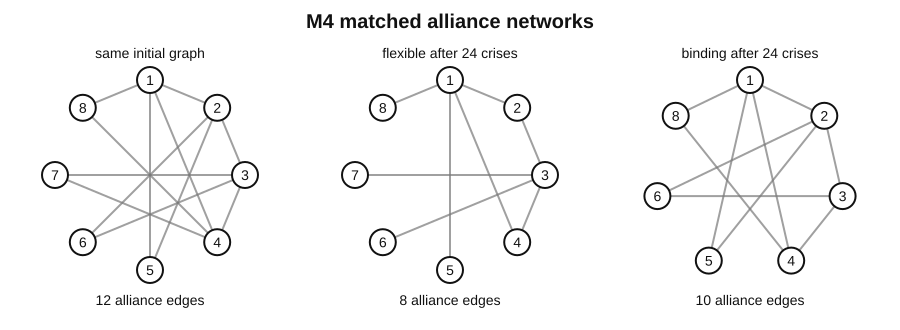
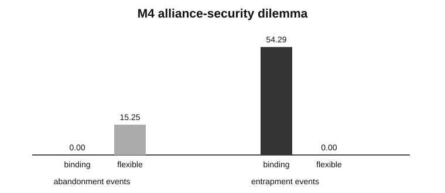

# Game of International Life

[](https://github.com/ReloadLightly/game-of-international-life/actions/workflows/ci.yml)
[](https://www.python.org/)
[](LICENSE)

**Computational IR in Python: cellular automata, emergent states, and matched experiments on security, power, and alliance politics under anarchy.**

> What happens when an international-relations theory is translated into explicit local rules, placed in the same artificial world as its rivals, and forced to generate its consequences?

Game of International Life starts with Conway's Game of Life and grows toward **artificial geopolitics**: spatial worlds in which borders, capabilities, conquest, fragmentation, alliance networks, abandonment, entrapment, and conflict cascades emerge from inspectable rules rather than being scripted as outcomes.

The project is deliberately cumulative. Each milestone adds one substantive mechanism while preserving previous worlds as baselines.

| Milestone | Model | Research question | Status |
|---|---|---|---|
| **M0** | Conway B3/S23 | Can the CA engine reproduce canonical emergence exactly? | ✅ |
| **M1** | Jervisian security-dilemma CA | How do offense–defense advantage and distinguishability shape arming and conflict? | ✅ |
| **M2** | Hexagonal territorial states | Can states, borders, conquest, extinction, and fragmentation emerge on a shared substrate? | ✅ |
| **M3** | Security seeking vs. power maximization | What changes when security seeking stops at sufficiency but relative-power seeking does not? | ✅ |
| **M4** | Snyderian alliance politics | When do stronger commitments reduce abandonment but increase entrapment and conflict diffusion? | ✅ |
| **M5+** | Perception, signaling, evolution | Can richer uncertainty and evolved rules explain where hand-coded theories succeed or fail? | planned |

<p align="center">
  
</p>

## Why this is not IR-themed Game of Life

A weak version of the idea would rename a live cell “state,” cell death “war,” and a glider “power transition.” That would be fun for five minutes and scientifically empty.

This repository instead separates four things:

```text
world mechanics ≠ policy rule ≠ experiment design ≠ interpretation
```

Every theory-bearing model must make the causal chain explicit:

```text
assumptions
    → actor-visible information
    → decision rule
    → interaction process
    → process trace
    → system-level outcome
    → failure condition
```

Rival theories should inhabit the **same world** whenever possible. Geography, resources, capability accounting, battle physics, and stochastic shocks are not quietly changed to make one theory look better.

## M4 — Alliance politics as a second topology

Territory is spatial. Alliances are relational. M4 therefore adds a weighted alliance graph **above** the M2/M3 hexagonal world rather than forcing strategic ties into geographic adjacency.

Each M4 state carries:

- a territorial state from M2/M3;
- reciprocal alliance commitments;
- directed reliability beliefs;
- directed threat perceptions;
- exact initial capability distributions;
- crisis, support, alliance-change, and territorial battle traces.

A crisis begins with a feasible territorial dispute. Allies may provide **full support**, **partial support**, or **withhold support**. Contributions change the realized attacker/defender balance, while supporters pay explicit costs. The resulting territorial battle is resolved by the same engine used in M2/M3, including conquest, extinction, and fragmentation.

### The Snyderian dilemma

M4 compares two deliberately stylized commitment doctrines.

**Binding commitment** has broad defensive and offensive scope, lower thresholds for honoring commitments, low entrapment aversion, and slower relationship revision. It makes support dependable but can pull allies into crises they would not independently choose.

**Flexible commitment** narrows offensive scope, demands more direct interest before supporting a partner, has greater entrapment aversion, and revises relationships faster. It preserves autonomy but makes promises less dependable.

The model traces the mechanisms rather than hiding them in one welfare score:

- **abandonment** — an ally receives less support than its commitment led it to expect;
- **entrapment** — a supporter pays for a partner's offensive crisis despite low direct threat;
- **chain-ganging** — allied mobilization expands a bilateral crisis across both sides;
- **buck-passing** — an actor with substantial direct threat still withholds defensive support;
- **conflict diffusion** — third parties enter an initially bilateral dispute;
- **alliance turnover** — ties form or dissolve as reliability and commitment change.

### Frozen M4 experiment

The first experiment crosses:

```text
commitment doctrine ∈ {binding, flexible}
polarity            ∈ {bipolar, multipolar}
threat distribution ∈ {concentrated, diffuse}
```

Default design:

```text
12 × 16 hex cells
8 initial states
24 crisis generations
6 seeds per structural condition
48 histories
24 matched doctrine pairs
```

Within a doctrine pair, both histories begin from the same territorial map, resources, exact capabilities, alliance graph, reliability beliefs, threat matrix, territorial parameters, and encounter-keyed battle shocks. The bundled commitment doctrine is the treatment.

Run it with:

```bash
international-life m4 --output-dir artifacts/m4
```

### Reference mechanism check

The committed v0.4 reference run is a **generative mechanism experiment**, not an empirical validation of Snyder. Means across the 24 histories for each doctrine were:

| Observable | Binding | Flexible |
|---|---:|---:|
| Abandonment events | **0.00** | **15.25** |
| Entrapment events | **54.29** | **0.00** |
| Chain-ganging crises | **24.00** | **0.00** |
| Third-party participations | **135.62** | **52.25** |
| Support cost | **951.89** | **464.27** |
| Total conflict cost | **1440.97** | **751.13** |
| Final alliance edges | **17.38** | **13.71** |
| Original-state survival | **0.964** | **1.000** |

<p align="center">
  
</p>

The required qualitative trade-off is present: binding commitments eliminate abandonment in this reference ensemble while creating substantial entrapment and much broader conflict participation. That verifies that the alliance-security-dilemma mechanism is behaviorally live. It does **not** imply that binding or flexible alliances are generally preferable in real international politics.

The exact compact results are committed in [`docs/results/`](docs/results/), and the model contract is documented in [`docs/m4-alliance-politics.md`](docs/m4-alliance-politics.md).

## Earlier milestones

### M0 — Conway's Game of Life

A faithful NumPy implementation of B3/S23 with synchronous updates, fixed and toroidal boundaries, and canonical block, blinker, glider, and R-pentomino tests. Conway remains Conway: it teaches the grammar of cellular automata rather than serving as a decorative IR metaphor.

### M1 — Jervis's four strategic worlds

A finite-state security-dilemma CA varies **offense–defense advantage** and **offense–defense distinguishability** under matched initial worlds. The model asks when defensive arming reassures, deters, or produces spiraling threat responses.

<p align="center">
  
</p>

Read [`docs/m1-jervis-model.md`](docs/m1-jervis-model.md).

### M2 — Territorial states on a hexagonal world

M2 separates stable geographic cells from mutable political control. Connected states aggregate local resources into capability, fight over adjacent territory, pay explicit war costs, disappear through conquest, and split into traceable successor states when territorial bridges are severed.

<p align="center">
  
</p>

Read [`docs/m2-territorial-model.md`](docs/m2-territorial-model.md).

### M3 — Security seeking versus power maximization

M3 places two strategic rules in exactly the same territorial worlds. A security seeker stops expanding after reaching a declared capability-sufficiency threshold. A power maximizer continues exploiting favorable relative-power opportunities. Initial worlds are hashed and shared encounters receive common random shocks.

The committed M3 reference experiment contains 48 histories / 24 matched pairs. Read [`docs/m3-structural-comparison.md`](docs/m3-structural-comparison.md).

## Installation

Python 3.11+:

```bash
git clone https://github.com/ReloadLightly/game-of-international-life.git
cd game-of-international-life
python -m venv .venv
python -m pip install -e ".[dev]"
pytest
ruff check .
```

With `uv`:

```bash
uv sync --extra dev
uv run pytest
```

## Reproduce the experiments

```bash
# Conway
international-life conway --pattern glider --steps 40

# Jervis four-world comparison
international-life four-worlds --steps 80 --seeds 12 --output-dir artifacts/m1

# One territorial history
international-life territorial --steps 60 --seed 3 --output artifacts/m2.png

# M3 structural comparison
international-life m3 --output-dir artifacts/m3

# M4 alliance-security-dilemma comparison
international-life m4 --output-dir artifacts/m4
```

Every substantive matched experiment writes machine-readable configuration, generation-level traces, run summaries, ensemble summaries, within-world paired differences, and figures derived from those outputs.

## Architecture

```text
src/international_life/
├── core.py                     # square-lattice CA primitives
├── conway.py                   # M0
├── jervis.py                   # M1
├── hexgrid.py                  # six-neighbor spatial geometry
├── territorial.py             # M2/M3 territorial public API
├── structural.py              # M3 structural treatments
├── alliances.py               # M4 public API
├── _territorial/              # shared territorial state/policy/resolver
├── _alliances/                # M4 graph state, doctrine, dynamics, metrics
└── experiments/               # reproducible matched designs
```

M4 reaches into the territorial engine through one narrow seam: `territorial_step_from_orders`. The alliance layer can alter support around an already selected crisis, but the lower-level battle, cost, conquest, extinction, and fragmentation machinery remains shared.

## What “testing an IR theory” means here

The repository distinguishes three levels of evidence:

1. **Generative mechanism test** — can explicit micro-rules generate the macro-pattern associated with the theory?
2. **Discriminating computational experiment** — do rival rules produce different process signatures under matched artificial histories?
3. **Empirical test** — can a model initialized or calibrated with documented data explain or predict held-out historical processes better than alternatives?

M1 is primarily Level 1. M3 and M4 reach Level 2. The repository does **not** yet claim Level 3.

## Design principles

1. Faithful baselines before metaphor.
2. Mechanisms before theory labels.
3. One shared world for rival rules.
4. Matched histories before anecdotes.
5. Process observables alongside outcomes.
6. Explicit costs: stronger security arrangements are never free magic.
7. Small executable experiments before engineering layers.
8. Hand-coded theory baselines before evolutionary search.
9. No validation theater: artificial-world evidence is labeled as such.

## Roadmap

**M5 — Perception and signaling.** Put Jervisian uncertainty on the territorial-alliance world: actual versus perceived posture, noisy capability estimates, offense–defense advantage, distinguishability, reassurance, deterrence, and mobilization signals.

**M6 — Evolutionary rule discovery.** Evolve compact, inspectable decision lists, Boolean rules, finite-state programs, or typed GP trees across distributions of artificial worlds. M1–M5 become interpretable baselines rather than sacred endpoints.

**M7 — Computational fossil record.** Faithfully reconstruct major spatial IR ancestors such as Bremer & Mihalka's *Politics among Hexagons* and Cederman's emergent-polarity/state-formation models before adding modern extensions.

**M8 — Empirical contact.** Introduce documented geography, capabilities, alliances, and conflicts only when the variables have defensible mappings to evidence and calibration/evaluation periods can be separated.

## Intellectual lineage

The project connects John Conway's Game of Life; Bremer & Mihalka's *Machiavelli in Machina / Politics among Hexagons*; Jervis on the security dilemma; Waltz on system structure; Snyder on alliance politics; Cederman on emergent actors and polarity; Mearsheimer on offensive realism; and Hitoshi Iba's work on agent-based modeling, cellular automata, artificial life, and evolutionary rule discovery.

See [`docs/research-program.md`](docs/research-program.md) for the broader trajectory.

## Citation and license

MIT licensed. Citation metadata are in [`CITATION.cff`](CITATION.cff).
