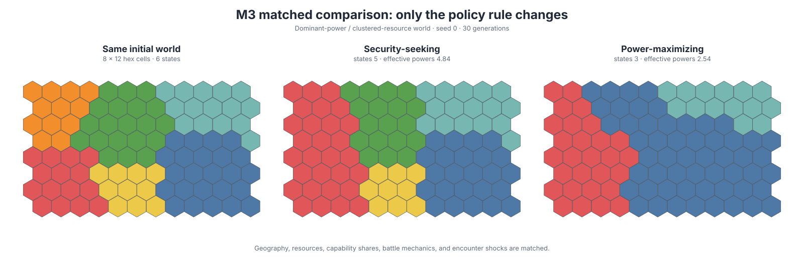
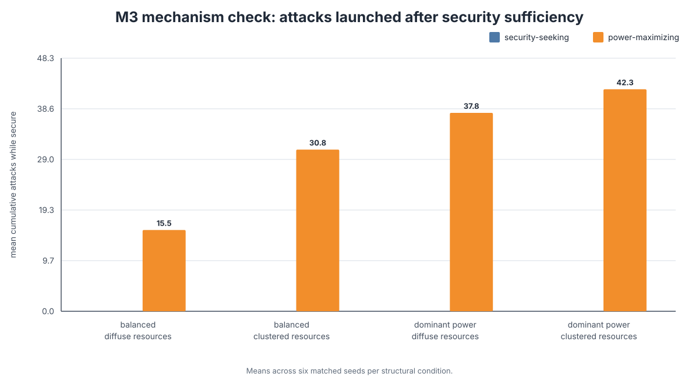

# Game of International Life

[](https://github.com/ReloadLightly/game-of-international-life/actions/workflows/ci.yml)
[](https://www.python.org/)
[](LICENSE)

## From Conway's Game of Life to artificial geopolitics

**Game of International Life is a computational laboratory for international relations: cellular automata, emergent territorial states, and matched experiments on security, power, alliances, and adaptation under anarchy.**

The project asks a deliberately demanding question:

> When an international-relations theory is translated into explicit local rules and placed in the same artificial world as its rivals, what patterns of order and disorder actually emerge?

The repository begins with a faithful implementation of Conway's Game of Life, then moves toward theory-bearing artificial worlds in which arms races, borders, territorial states, polarity, conquest, fragmentation, alliance dilemmas, and eventually new strategic rules can emerge from interaction rather than being scripted as outcomes.

<p align="center">
  
</p>

The figure above is a matched computational experiment. The initial geography, resources, capability distribution, battle mechanics, and stochastic shock schedule are identical. Only the policy rule changes.

## Why this is not just IR-themed Game of Life

A weak version of this project would rename Conway's live cells “states,” dead cells “failed states,” and cell death “war.” That would be visually charming and theoretically empty.

Game of International Life instead keeps two layers separate:

1. **Canonical cellular automata** teach the formal grammar of local interaction, synchronous updating, neighborhoods, rule spaces, phase behavior, and emergence.
2. **Theory-bearing models** define what a cell, polity, capability, signal, border, alliance, action, and outcome mean before a simulation is run.

Every theory implementation must expose a complete chain:

```text
assumptions
    → information available to actors
    → local decision rule
    → interaction process
    → system-level observable
    → failure condition
```

A theory's name is never accepted as a substitute for a mechanism.

## Current research ladder

| Milestone | Artificial world | Question | Status |
|---|---|---|---|
| **M0** | Conway B3/S23 | Can the CA engine reproduce canonical still lifes, oscillators, and moving patterns exactly? | Implemented |
| **M1** | Jervisian security-dilemma CA | How do offense–defense advantage and distinguishability shape arming and conflict? | Implemented |
| **M2** | Hexagonal territorial world | Can connected states, borders, capabilities, conquest, extinction, and fragmentation emerge on a common substrate? | Implemented |
| **M3** | Matched structural-policy experiment | What changes when security-seeking stops at sufficiency but power maximization continues beyond it? | Implemented |
| **M4** | Spatial world plus alliance graph | When do stronger commitments prevent abandonment but increase entrapment and conflict cascades? | Next |
| **M5+** | Evolved and empirically grounded worlds | Can GA/GP discover interpretable strategic rules that outperform or extend hand-coded theories? | Planned |

## M3 — Security seeking versus power maximization

M3 is the first experiment in the repository where rival strategic rules inhabit **the same world**.

### The shared world

Both policies receive the same:

- six-neighbor hexagonal geography;
- initial territorial borders;
- spatial resource field;
- exact initial capability distribution;
- polity-level treasury and production mechanics;
- fortification, mobilization, attack, defense, and conquest rules;
- one-action-per-polity constraint;
- synchronous transition schedule;
- stochastic battle shocks.

Each initial world is hashed. Matched policy runs must carry the same fingerprint or the experiment aborts. Battle noise is keyed to the potential encounter—generation, attacker, defender, and target cell—rather than to the position of an attack in an order list. Thus, a shared encounter receives the same shock even when one policy launches additional attacks elsewhere.

### The only intended difference

#### Security-seeking policy

A polity compares its capability with that of its strongest adjacent rival. When its security ratio is below a declared sufficiency threshold, it may take a feasible territorial action that repairs vulnerability. Once the threshold is reached, it abstains even if further expansion would be easy.

#### Power-maximizing policy

A polity uses the same information, candidate targets, feasibility threshold, and battle mechanics. It also values gains in relative capability, productive territory, and weakening powerful rivals. It therefore continues to exploit favorable opportunities after immediate security sufficiency has been reached.

These are deliberately minimal **computational probes inspired by defensive and offensive structural realism**. They are not claims that Kenneth Waltz or John Mearsheimer can be reduced to a few lines of Python.

### Frozen experimental design

M3 crosses three dimensions:

| Dimension | Condition A | Condition B |
|---|---|---|
| Initial capability distribution | Eight balanced powers | One 35% dominant power plus seven smaller powers |
| Resource geography | Diffuse resources | Spatially clustered resources |
| Strategic rule | Security seeking | Power maximization |

The default command runs six matched seeds in each structural condition: **48 policy histories arranged as 24 paired comparisons**.

```bash
international-life m3 --output-dir artifacts/m3
```

The default reference design uses a `12 × 16` hex world, eight initial states, and forty generations. It normally completes in well under a minute on a modern laptop.

### What the reference run shows

The bundled v0.3 reference run is a software-and-mechanism check, not an empirical finding. Across its 24 matched pairs, the mean difference below is defined as:

```text
power-maximizing minus security-seeking
```

| Observable | Mean paired difference |
|---|---:|
| Attack orders | **+21.54** |
| Attacks after security sufficiency | **+31.63** |
| Cumulative war cost | **+135.73** |
| Territorial conquests | **+20.83** |
| Final capability HHI | **+0.041** |
| Original-state survival rate | **−0.115** |
| Final state count | **−0.96** |

<p align="center">
  
</p>

The most important result is the first mechanism check: the security-seeking rule launches no attacks after its own sufficiency criterion is met, while the power-maximizing rule does so in every paired reference world. The later differences in war cost, conquest, concentration, and survival arise endogenously through feedback. They are average tendencies, not universal laws: some individual seeds produce reversals.

The exact manifest and compact result tables are committed under [`docs/results/`](docs/results/):

- [`m3-reference-manifest.json`](docs/results/m3-reference-manifest.json)
- [`m3-reference-ensemble-summary.csv`](docs/results/m3-reference-ensemble-summary.csv)
- [`m3-reference-paired-differences.csv`](docs/results/m3-reference-paired-differences.csv)

The complete model specification, hypotheses, equations, observables, and limits are in [`docs/m3-structural-comparison.md`](docs/m3-structural-comparison.md).

## Earlier worlds

### M0 — Conway's Game of Life

M0 provides a transparent NumPy implementation of the canonical **B3/S23** rule with:

- synchronous updates;
- fixed and toroidal boundaries;
- block, blinker, glider, and R-pentomino seeds;
- regression tests for still lifes, periodicity, and glider translation.

<p align="center">
  
</p>

Conway remains Conway. The model is a formal baseline, not a decorative allegory for world politics.

### M1 — Jervis's four strategic worlds

Each square-lattice cell is a polity with a discrete arms level, an offensive or defensive posture, locally perceived threat, and a conflict state. Two controls operationalize the first theory-bearing experiment:

1. **Offense advantage**, from strong defense dominance to strong offense dominance.
2. **Distinguishability**, from complete ambiguity to perfect separation of offensive and defensive postures.

<p align="center">
  
</p>

The surface is a generative mechanism test: it checks whether changing the theoretical controls changes arming and conflict in the intended direction under matched initial worlds. It does not validate the theory against history.

Read [`docs/m1-jervis-model.md`](docs/m1-jervis-model.md).

### M2 — Territorial states on a hexagonal world

M2 separates **geographic identity** from **political identity**. A stable hexagonal site carries local resources and fortification; a mutable polity ID records who controls it. Contiguous states aggregate resources into treasury and capability, contest neighboring territory, pay explicit war costs, disappear through conquest, and split into traceable successor states when their territory becomes disconnected.

<p align="center">
  
</p>

M2 measures:

- state count and size distribution;
- capability shares, HHI, and effective number of powers;
- interstate border length;
- battles, conquests, and territorial turnover;
- war costs;
- extinctions, fragmentation, and successor formation.

Its default opportunistic policy is a substrate test, not a realism theory. M3 replaces only the policy while preserving the world.

Read [`docs/m2-territorial-model.md`](docs/m2-territorial-model.md).

## Installation

Python 3.11 or newer is recommended.

```bash
git clone https://github.com/ReloadLightly/game-of-international-life.git
cd game-of-international-life
python -m venv .venv
```

Activate the environment, then install the package and development tools:

```bash
python -m pip install -e ".[dev]"
pytest
ruff check .
```

With `uv`:

```bash
uv sync --extra dev
uv run pytest
```

## Run the models

### Conway

```bash
international-life conway \
  --pattern glider \
  --size 40 \
  --steps 40 \
  --boundary wrap \
  --output artifacts/conway_final.png
```

### One Jervisian world

```bash
international-life jervis \
  --size 40 \
  --steps 80 \
  --seed 3 \
  --offense-advantage 0.75 \
  --distinguishability 0.25 \
  --output artifacts/jervis_final.png
```

### Jervis four-world comparison

```bash
international-life four-worlds \
  --steps 80 \
  --seeds 12 \
  --output-dir artifacts/jervis-four-worlds
```

### One territorial history

```bash
international-life territorial \
  --height 24 \
  --width 32 \
  --states 10 \
  --steps 60 \
  --seed 3 \
  --output artifacts/territorial_final.png
```

### Territorial ensemble

```bash
international-life territorial-ensemble \
  --height 24 \
  --width 32 \
  --states 10 \
  --steps 60 \
  --seeds 6 \
  --output-dir artifacts/territorial-ensemble
```

### M3 structural comparison

```bash
international-life structural-compare \
  --height 12 \
  --width 16 \
  --states 8 \
  --steps 40 \
  --seeds 6 \
  --dominant-share 0.35 \
  --output-dir artifacts/m3
```

`m3` is an alias for `structural-compare`.

## M3 output contract

Every M3 run writes:

| File | Purpose |
|---|---|
| `m3_manifest.json` | Complete design, shared dynamics, policy parameters, and matching contract |
| `m3_timeseries.csv` | Every generation of every policy history |
| `m3_run_summary.csv` | One row per policy × structure × seed run |
| `m3_ensemble_summary.csv` | Means by policy and structural condition |
| `m3_paired_differences.csv` | Within-world power-minus-security contrasts |
| `m3_matched_worlds.png` | One initial world and its two divergent policy histories |
| `m3_attacks_while_secure.png` | Direct stopping-rule mechanism check |
| `m3_war_cost.png` | Systemic mobilization cost comparison |
| `m3_power_concentration.png` | Final capability concentration comparison |

The raw tables are the result. The figures are views generated from those tables or their underlying histories.

## Code architecture

```text
src/international_life/
├── core.py                         # square-lattice update primitives
├── conway.py                       # faithful B3/S23
├── jervis.py                       # M1 security-dilemma CA
├── hexgrid.py                      # six-neighbor geometry and connectivity
├── territorial.py                 # compact M2/M3 public API
├── structural.py                  # M3 conditions and public policy API
├── _territorial/
│   ├── types.py                    # immutable worlds, orders, and events
│   ├── initialization.py           # connected maps and resource fields
│   ├── measures.py                 # polity and system observables
│   ├── policy.py                   # shared candidates and rival rules
│   └── dynamics.py                 # common battle and succession engine
└── experiments/
    ├── jervis_four_worlds.py
    ├── jervis_phase_diagram.py
    ├── territorial_ensemble.py
    └── structural_comparison.py
```

The architectural boundary is intentional:

```text
world mechanics ≠ policy rule ≠ experiment design ≠ interpretation
```

This makes rival theories comparable and later allows hand-coded rules to become baselines, ancestors, or behavioral descriptors for evolutionary search.

## What “testing an IR theory” means here

The repository distinguishes three levels of evidence.

### 1. Generative mechanism test

Can the theory's explicit micro-rules generate the macro-pattern associated with it? For example, can ambiguous defensive arming generate a spiral without any aggressive central planner?

### 2. Discriminating computational experiment

Do rival rules produce different process signatures or outcomes under the same artificial histories? M3 reaches this level by changing only the stopping objective while matching worlds and shocks.

### 3. Empirical test

Can models initialized or calibrated with documented historical data predict or reconstruct held-out processes better than rival models? The repository has not reached this level, and it does not claim otherwise.

A beautiful final map is never sufficient evidence. Useful comparisons require matched worlds, ensembles, process observables, sensitivity analysis, and explicit failure conditions.

## Design principles

1. **Faithful baselines before metaphor.** Canonical CA implementations remain canonical.
2. **Mechanisms before labels.** Every named theory must specify information, decisions, and observables.
3. **One shared world for rival rules.** A theory does not receive friendlier geography or combat mechanics.
4. **Matched histories before anecdotes.** Seeds, fingerprints, and stochastic schedules are recorded.
5. **Process as well as outcome.** Similar end states may conceal different causal paths.
6. **Small executable experiments before elaborate frameworks.** Complexity must answer a concrete question.
7. **Hand-coded theories before evolution.** GA/GP search needs intelligible baselines and interpretable representations.
8. **No validation theater.** A model can verify a mechanism without validating a historical theory.

## Roadmap

### M4 — Snyderian alliance politics

Add a graph layer above the territorial lattice so strategic ties need not coincide with geography. The first experiment will vary alliance commitment and polarity while measuring abandonment, entrapment, chain-ganging, buck-passing, bloc formation, and conflict diffusion.

### M5 — Jervis on the territorial world

Add incomplete information about posture, capability, and intention to territorial states. This will connect spiral–deterrence dynamics with borders, mobilization, and conquest rather than treating each cell as an isolated polity.

### M6 — Evolutionary rule discovery

Use compact, inspectable representations—decision lists, typed GP trees, Boolean expressions, or finite-state programs—to evolve policies across distributions of worlds. Hand-coded Jervisian, security-seeking, power-maximizing, and alliance policies become baselines rather than sacred endpoints.

### M7 — Computational fossil-record replications

Reconstruct major spatial IR models, separating faithful replication from modern extension. Priority ancestors include Bremer and Mihalka's *Politics among Hexagons* and Cederman's models of emergent polarity and state formation.

### M8 — Empirical contact

Introduce documented geography, capability, alliance, and conflict data only when parameters and observables have clear empirical meaning. Calibration and evaluation periods must remain separate.

## Intellectual lineage

The project sits at the intersection of cellular automata, artificial life, complex systems, evolutionary computation, and international-relations theory. Key starting points include:

- John Conway's Game of Life, introduced publicly by Martin Gardner (1970);
- Stuart Bremer and Michael Mihalka, “Machiavelli in Machina: Or Politics among Hexagons” (1977);
- Robert Jervis, “Cooperation under the Security Dilemma” (1978);
- Kenneth Waltz, *Theory of International Politics* (1979);
- Glenn Snyder, “The Security Dilemma in Alliance Politics” (1984) and *Alliance Politics* (1997);
- Lars-Erik Cederman, “Emergent Polarity” (1994) and *Emergent Actors in World Politics* (1997);
- John Mearsheimer, *The Tragedy of Great Power Politics* (2001);
- Hitoshi Iba, *Agent-Based Modeling and Simulation with Swarm* (2013).

See [`docs/research-program.md`](docs/research-program.md) and [`docs/theory-to-mechanism.md`](docs/theory-to-mechanism.md) for the larger research agenda.

## Verification

At the v0.3 checkpoint:

- **38 tests pass**;
- **94% statement coverage** in the local verification run;
- deterministic replay is tested;
- geographic identity remains stable while political control changes;
- every represented polity is contiguous after each transition;
- matched policy runs are audited through initial-world fingerprints;
- encounter-level common random numbers are tested;
- CI runs on Python 3.11 and 3.12.

## Contributing

Contributions are welcome when they sharpen a mechanism, replication, experiment, invariant, or theoretical comparison. Read [`CONTRIBUTING.md`](CONTRIBUTING.md) before opening a substantial pull request.

## Citation and license

The project is released under the [MIT License](LICENSE). Citation metadata are available in [`CITATION.cff`](CITATION.cff).

```bibtex
@software{loechli_game_of_international_life_2026,
  author  = {Roland Löchli},
  title   = {Game of International Life},
  year    = {2026},
  version = {0.3.0},
  url     = {https://github.com/ReloadLightly/game-of-international-life}
}
```
